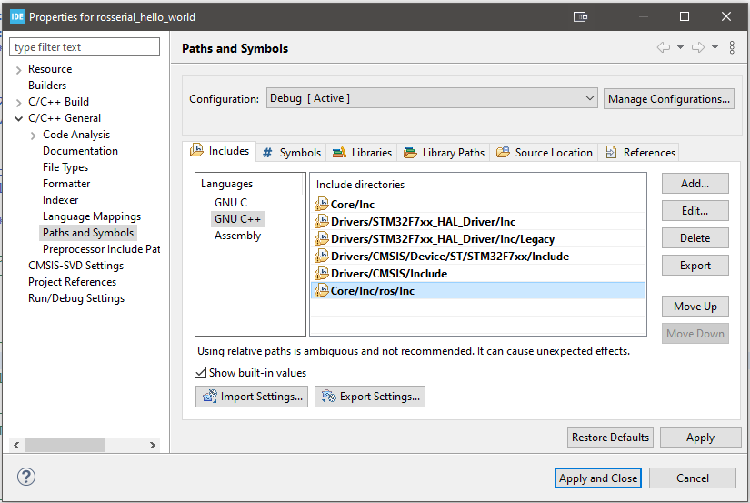

# rosserial-stm-prebuilt

## Files in this Repository

__/example__  
Example main.c and C++ demo publisher/subscriber application.

__/ROS__
Prebuilt ROS C++ ROS library.  
  

## Usage

1. Clone the repository.
2. Create a new STM32CubeIDE project.


3. Select the desired dev board.


4. Select C++ as the project target language.
  

5. Configure the IOC for the project. ROSSerial requires at least one UART to be enabled as well as DMA for the TX and RX channels.


6. Import the prebuilt ROS library from this repo by copy pasting it into the project's /Core/Inc folder.


7. Add the ROS library to the compile path by modifying the project properties.


8. Modify ROS hardware configuration settings to match the selected board and UART device in /```Core/Inc/ROS/Inc/STM32Hardware.h```
   


9.  *OPTIONAL* Import the mainpp.h, main.c, and mainpp.cpp files into /Core/Inc and /Core/Src respectively.

10. Your directory should look like this:
    


11.   Build and get no errors!